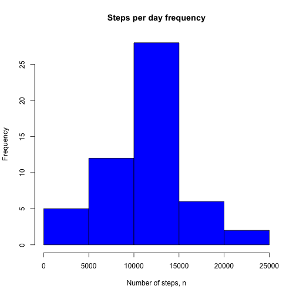
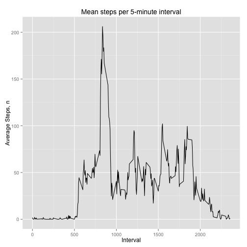

#Load the data

```r
library(ggplot2)
library(knitr)
setwd("~/Desktop/coursera/reproducibleResearch/assign1/code")
in.d <- "~/Desktop/coursera/reproducibleResearch/assign1/data/"
d<- read.csv(paste(in.d,'activity.csv',sep=''))
```

# Mean steps per day

```r
day.sum <- aggregate(steps~date, d, sum)
hist(day.sum$steps,xlab='Number of steps, n', main = 'Steps per day frequency',
     col='blue')
```

 

```r
paste('The mean number of steps per day was',mean(day.sum$steps))
```

```
## [1] "The mean number of steps per day was 10766.1886792453"
```

```r
paste('The median number of steps per day was',median(day.sum$steps))
```

```
## [1] "The median number of steps per day was 10765"
```

# Daily activity pattern

```r
ggplot(d,aes(x=interval,y=steps)) +stat_summary(fun.y="mean", geom="line")+ 
  xlab('Interval') + ylab('Average Steps, n') + 
  ggtitle(expression('Mean steps per 5-minute interval')) +
  theme(plot.title = element_text(size=14, face="bold")) 
```

```
## Warning: Removed 2304 rows containing missing values (stat_summary).
```

 

```r
int.means <- aggregate(steps~interval, d, mean)
paste('Interval with the highest mean is',
      int.means[int.means$steps==max(int.means$steps),c('interval')])
```

```
## [1] "Interval with the highest mean is 835"
```

#Number of missing values

```r
paste('There are',sum(is.na(d$steps)),'missing steps.')
```

```
## [1] "There are 2304 missing steps."
```

```r
paste('There are',sum(is.na(d$date)),'missing dates.')
```

```
## [1] "There are 0 missing dates."
```

```r
paste('There are',sum(is.na(d$interval)),'missing intervals.')
```

```
## [1] "There are 0 missing intervals."
```

#Replace missing values with the mean for that interval
## find missing rows

```r
missing <- which(is.na(d$steps)) 
```

## create copy of array and replace missing values with interval mean

```r
d1<-d
for (row in missing) {
  d1[row,c('steps')] <- 
    (int.means[int.means$interval==d1[row,c('interval')],c('steps')])
}
```

##Replot with missing values replaced

```r
day.sum1 <- aggregate(steps~date, d1, sum)
hist(day.sum1$steps,xlab='Number of steps, n', 
     main = 'Steps per day frequency, missing values imputed',
     col='blue')
```

 

```r
paste('The mean number of steps per day was',mean(day.sum1$steps))
```

```
## [1] "The mean number of steps per day was 10766.1886792453"
```

```r
paste('The median number of steps per day was',median(day.sum1$steps))
```

```
## [1] "The median number of steps per day was 10766.1886792453"
```
### With the missing values replaced, the mean does not change, but the median 
### becomes very similar to the mean.

# Are there differences in activity patterns between weekdays and weekends?

```r
d1$date2 <- as.Date(d1$date, format = "%Y-%m-%d")
d1$weekend <- 'Weekday'
d1[weekdays(d1$date2) %in% c("Saturday","Sunday"),c('weekend')] <- 'Weekend'
ggplot(d1,aes(x=interval,y=steps)) +stat_summary(fun.y="mean", geom="line")+ 
  facet_grid(weekend~.)+
  xlab('Interval') + ylab('Average Steps, n') + 
  ggtitle(expression('Mean steps per 5-minute interval')) +
  theme(plot.title = element_text(size=14, face="bold")) 
```

 

